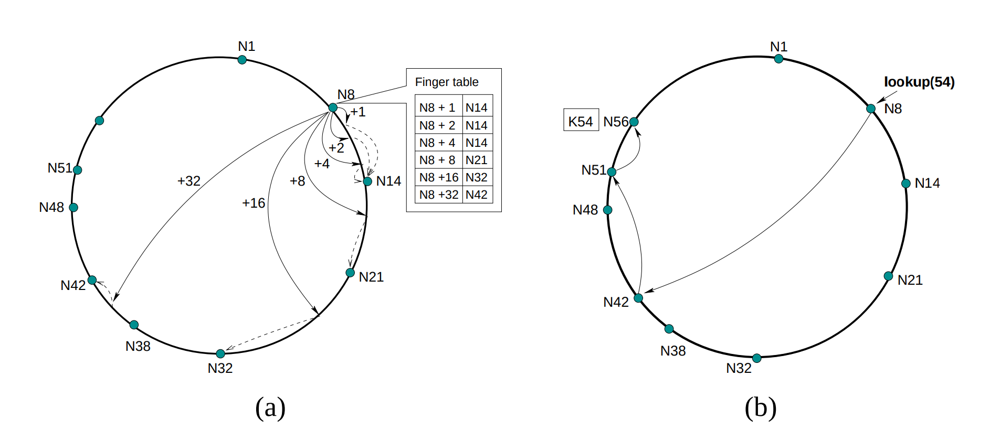

# Chord DHT Protocol Implementation in Go (work in progress..)

## Overview

This is a work-in-progress [Chord Distributed Hash Table Protocol Paper](https://pdos.csail.mit.edu/papers/ton:chord/paper-ton.pdf) implementation in Go.

## Features

- **Load balancing**: Chord acts as a distributed hash function,
spreading keys evenly over the nodes; this provides a degree of natural load balance.
- **Decentralization**: Chord is fully distributed: no node is
more important than any other. This improves robustness
and makes Chord appropriate for loosely-organized peerto-peer applications.
- **Scalability**: The cost of a Chord lookup grows as the log of
the number of nodes, so even very large systems are feasible. No parameter tuning is required to achieve this scaling.
- **Availability**: Chord automatically adjusts its internal tables to reflect newly joined nodes as well as node failures,
ensuring that, barring major failures in the underlying network, the node responsible for a key can always be found.
This is true even if the system is in a continuous state of
change.
- **Flexible naming**: Chord places no constraints on the structure of the keys it looks up: the Chord key-space is flat.
This gives applications a large amount of flexibility in how
they map their own names to Chord keys.