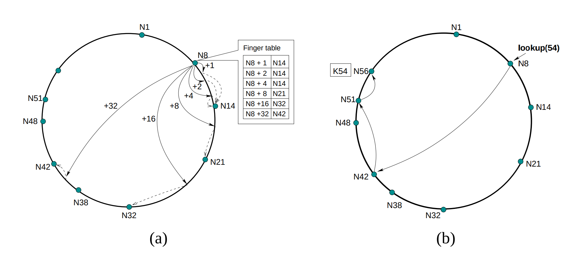

# Chord DHT Implementation in Go (work in progress..)

## Overview

This is a work-in-progress [Chord Distributed Hash Table (DHT) Paper](https://pdos.csail.mit.edu/papers/ton:chord/paper-ton.pdf) implementation in Go.

## Features

- **Consistent Hashing**: Achieves even data distribution across nodes for efficient retrieval.
- **Concurrency**: Utilizes Go's concurrency features for parallelism and optimal resource utilization.
- **Node Operations**: Implements node join/leave procedures and finger table maintenance for self-stabilization.
- **gRPC Integration**: Utilizes gRPC and Protocol Buffers for efficient and standardized communication between nodes.
